# 11_Praktikum 6

BAHASA PEMROGRAMAN

TEHNIK INFORMATIKA

UNIVERSITAS PELITA BANGSA

NAMA : GUNAWAN

NIM     : 312010191

KELAS   : TI.20.B1

DOSEN   : Agung Nugroho,S.Kom.,M.Kom

Tugas : Pertemuan 10

**Praktikum 6 : Program Sub Rutin / Fungsi**

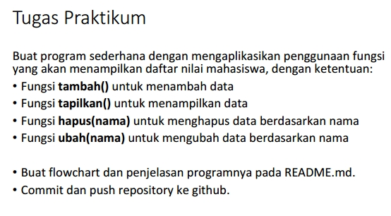

- Kita ketik Code perintah python yang sudah kita buat nama Praktikum6_Subrutin-fungsi.py : 

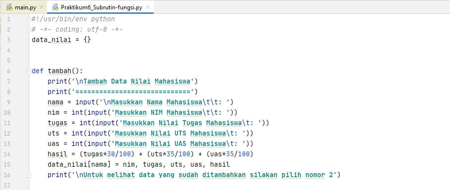
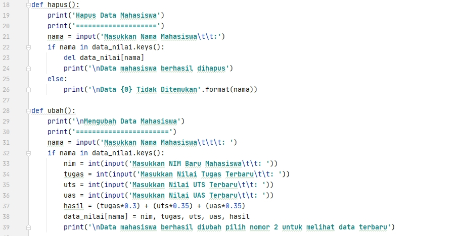
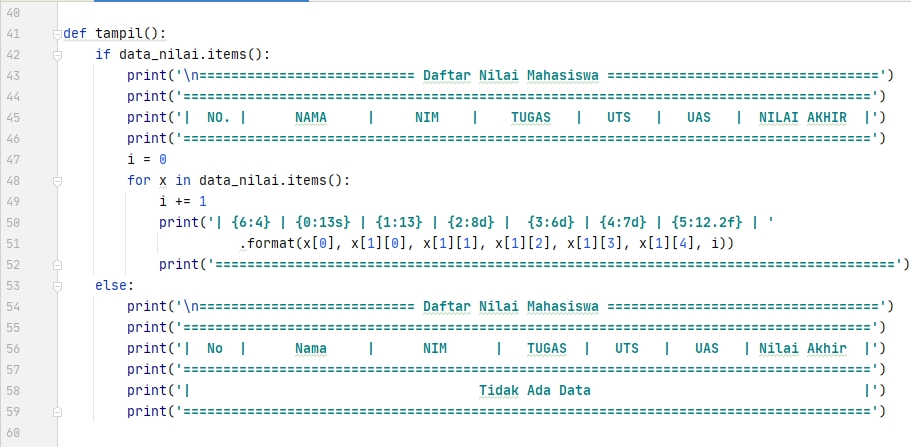
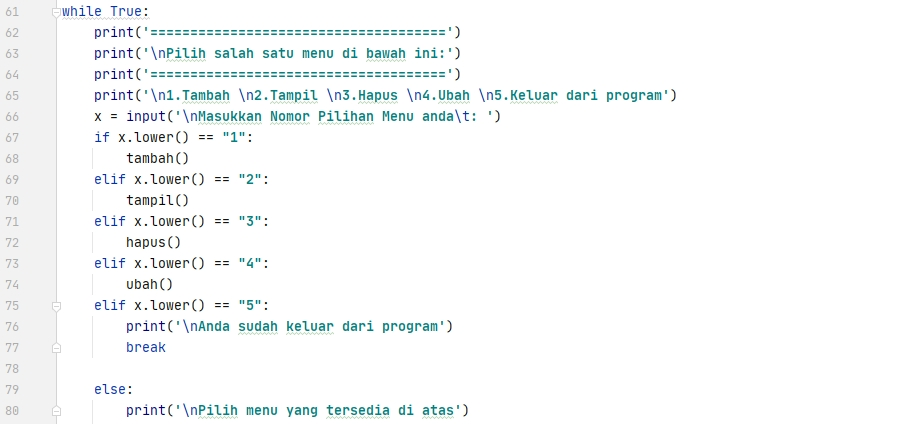

**Penjelasan :**

- Line 3 :
> - Kita menggunakan fungsi dictionary > ``data_nilai = {}``

- Line 6~16 :
> - def tambah, def digunakan untuk membuat fungsi lalu tambah
> - Lalu kita buat inputan nama, nim, nilai tugas, nilai uts, dan nilai uas, lalu kita buat hasil / total dari keseluruhan nilai

- Line 18~26 :
> - Lalu seperti biasa kita gunakan def hapus agar ketika kita memilih pilihan menu hapus
> - Kita buat inputan nama karena kita akan menghapus data nilai mahasiswa tersebut dengan menggunakan nama mereka untuk menghapusnya
> - lalu gunakan if untuk mengeksekusi data yang di dictionary menggunakan nama(True)
> - Lalu del untuk menghapus semua data nilai mahasiswa tersebut
> - Lalu kita buat else gunanya untuk ketika kita belum menginputkan data apapun maka tidak ada data yang bisa di hapus(False)

- Line 28~39 :
> - kita gunakan def ubah agar ketika kita memilih pilihan menu ubah akan masuk ke dalam syntax ini untuk mengubah data
> - Lalu kita buat inputan nama karena kita akan mengubah data nilai mahasiswa dengan menginputkan nama mahasiswa tersebut
> - Lalu if nama in data_nilai.keys untuk mengeksekusi jika nama terdapat di dalam dictionary
> - Lalu kita buat inputan untuk memasukkan nilai tugas, uts, dan uas yang terbaru
> - Lalu kita gunakan hasil untuk menghitung total semua nilai tersebut

- Line 41~59 :
> - kita gunakan if data_nilai.items gunanya untuk melihat hasil / menampilkan semua data di dalam dictionary(True)
> - Lalu kita gunakan print untuk membuat tablenya
> - Lalu for i = 0 digunakan untuk membuat nomor urut otomatis dibagian No. didalam table
> - Lalu kita gunakan for x gunanya untuk format penampilan data nilai mahasiswa
> - lalu gunanya angka yang di dalam {} itu di gunakan untuk membatasi atau bisa di bilang seperti tab agar data yang di tampilkan lebih rapih
> - Lalu else disini di gunakan ketika kita belum menginputkan atau menambahkan data apapun akan muncul tidak ada data(False)

- Line 61~80 :
> - Kita gunakan perulangan while True untuk membuat pilihan menunya
> - Karena tidak disuruh untuk menampilkan outputnya seperti apa jadi saya menggunakan nomor saja untuk membuat pilihan menunya alasannya agar terlihat lebih rapih dan mudah
> - Lalu kita buat dibawahnya inputan untuk memasukkan pilihan yang kita ingink
> - Lalu kita gunakan if dan elif agar ketika kita memiih menu 1, 2, 3, 4, atau 5 kita akan memasuki syntax yang def tadi
> - Lalu dibawahnya kita gunakan tambah, tampil, hapus, dan ubah untuk mengeksekusi syntax yang tadi, itulah kenapa kita menulisnya def tambah, def tampil, def hapus, dan def ubah
> - lalu kita break kita gunakan untuk keluar dari program tersebut
> - Lalu else digunakan agar ketika kita tidak memilih pilihan menu maka akan muncul tulisan "pilih menu yang tersedia diatas"

**FLowChart:**

-
Berikut tampilan hasil code program setelah di Run :

    Pilihan menu tambah, tampil, hapus, ubah, dan keluar dari program
**No.1 : Tambah data nilai mahasiswa**

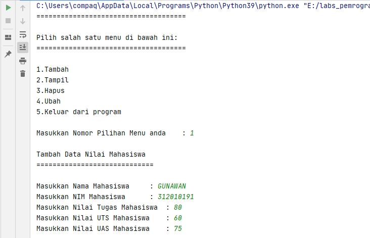

**No.2 : Tampilkan data nilai mahasiwa**

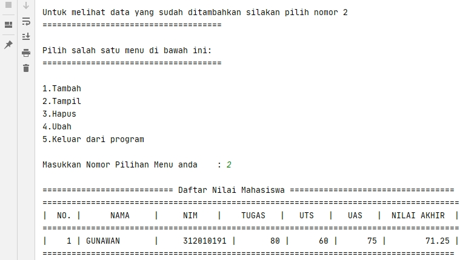

**No.1 : Tambah data lagi nilai mahasiswa**

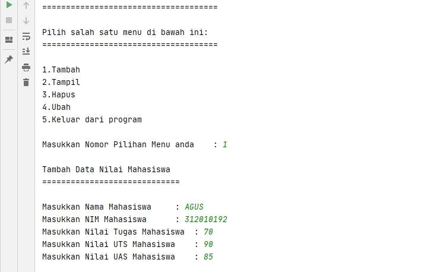

**No.2 : Tampilkan lagi data nilai mahasiwa yang di tambahkan** 

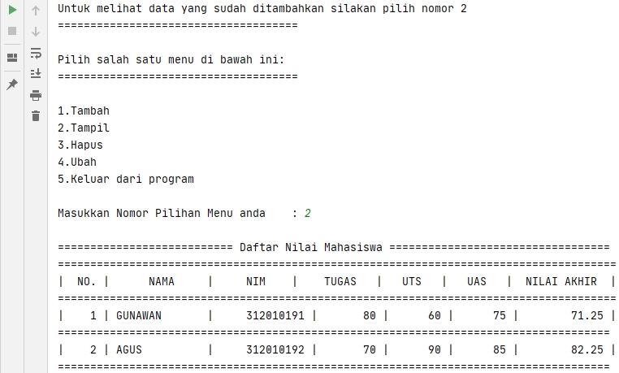

**No.3 : Hapus data nilai mahasiswa** 

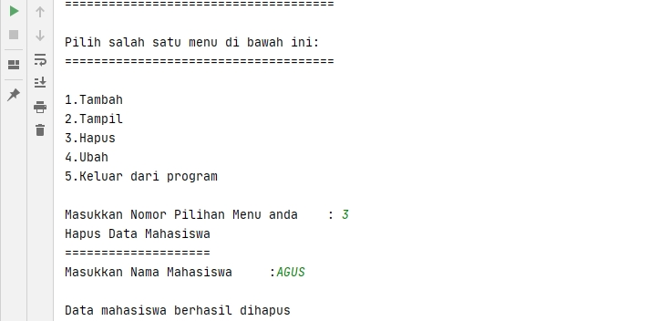

**No.2 : Tampilkan data nilai mahasiwa yang di hapus** 

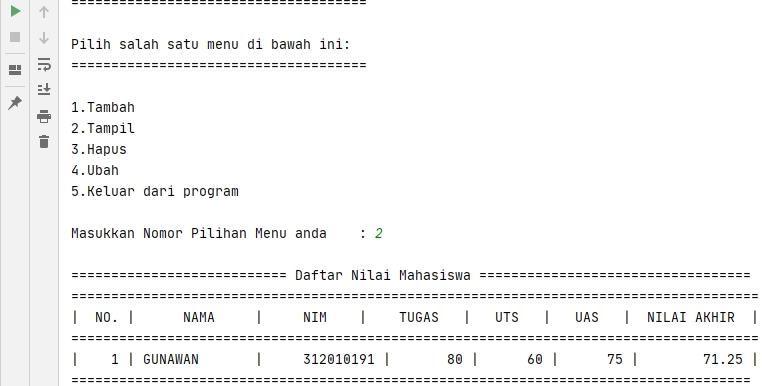

**No.4 : Ubah data nilai mahasiswa** 

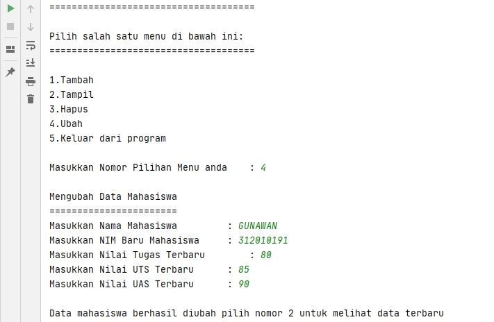

**No.2 : Tampilkan data nilai mahasiwa yang di Ubah** 

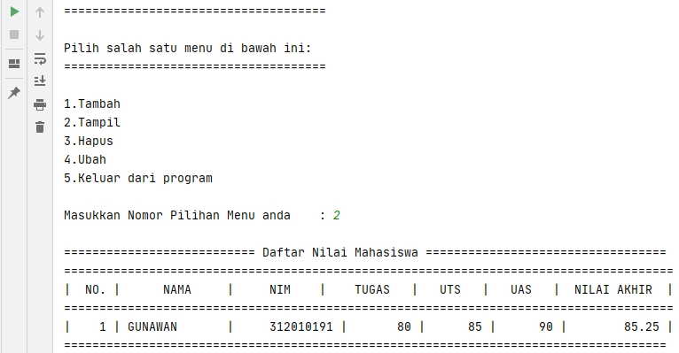

**No.5 : Keluar dari program** 

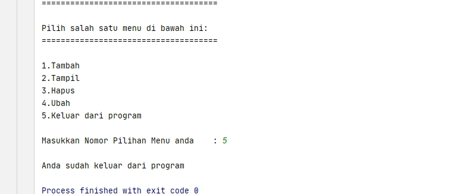

Cukup sekian penjelasan dari saya.

**Terimakasih**
